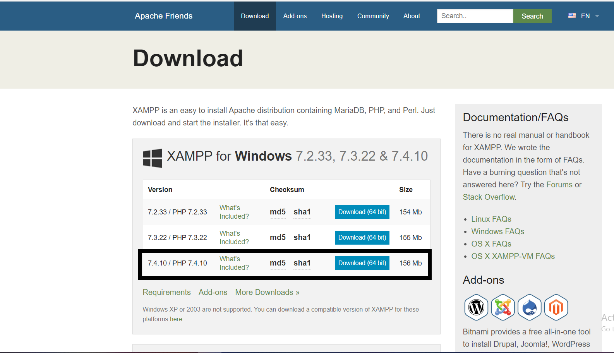
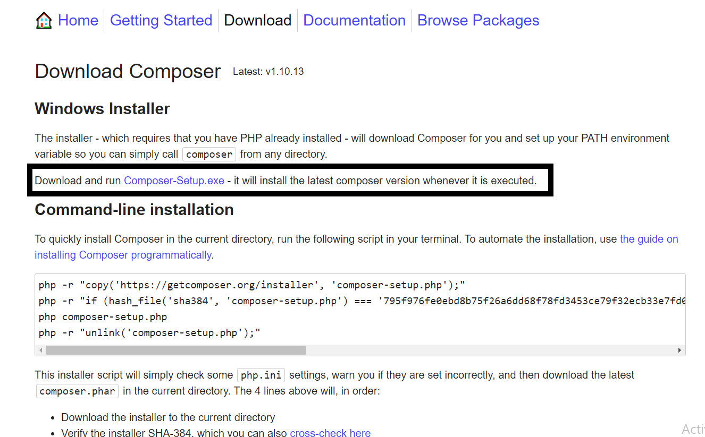
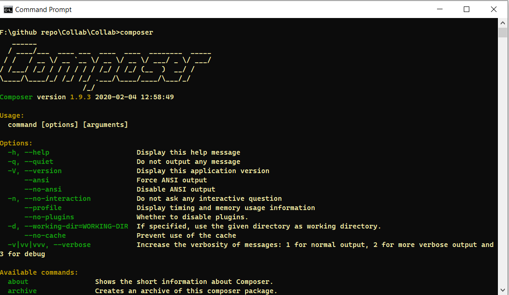
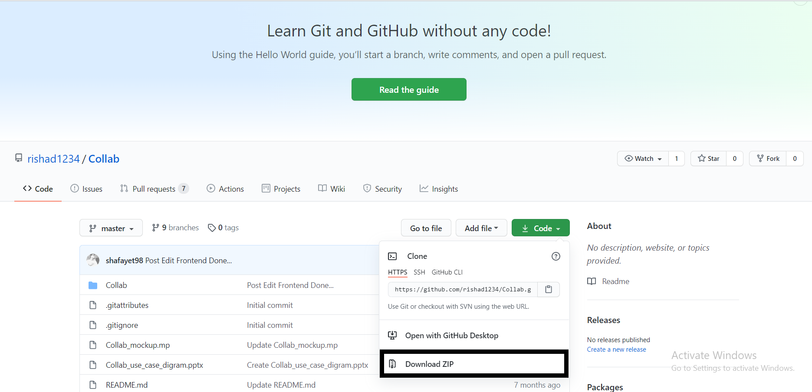
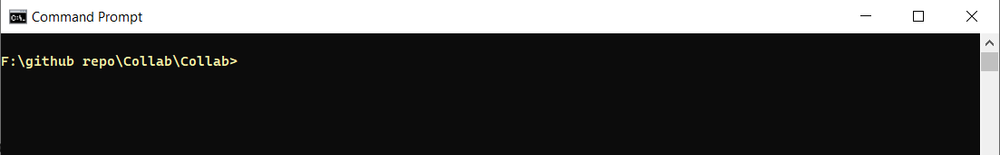
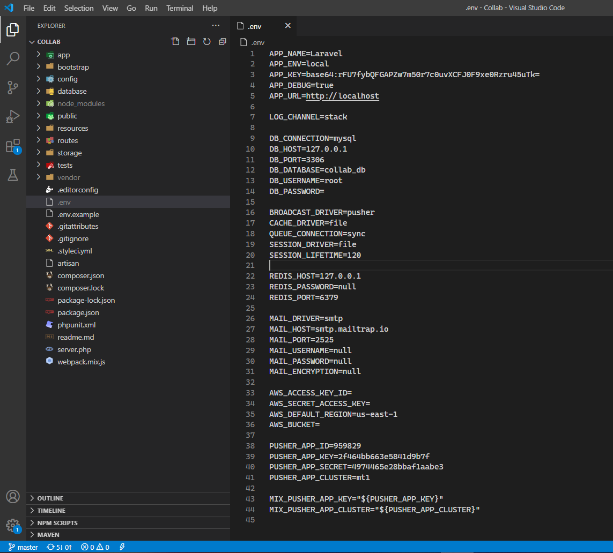

# Collab.
 
## Short Description
A platform that helps to create collaborations between professors and students according to their field of interests by helping them to create an individual profile, an organised news feed and communication methods.

## Environment Setup

### Xampp and PHP Setup
1. **[Go to this URL to install Xampp](https://www.apachefriends.org/download.html)**
2. **[Image]**


3. Install Xampp
4. Check the version of the xampp by using bellow command

`php -v`

5. You sould have PHP version greater or equal to 7.*

### Composer Setup
1. **[Go to this URL to install Composer](https://getcomposer.org/download/)**
2. Download Composer-Setup.exe
3. **[Image]**


4. Install Composer
5. Check Version of the composer by command

`composer`

6. **[Image]**


### Node Setup
**[Go to this URL to setup Node](https://nodejs.org/en/)**
1. Download Node LTS
2. Install Node
3. Check Version of the Node by command

`node -v`

4. You should have NODE version greater than or equal v12.18.*

5. Check the version of NPM by bellow command

`npm -v`

6. You should have NPM version greater than or equal 6.14.8
7. Check the version of LARAVEL by using this command

`laravel`

8. You should have LARAVEL version greater than or equal 3.0.1

## Project Setup

1. [Go to the github project URL](https://github.com/rishad1234/Collab)
2. Download the project zip file



3. Unzip the project
4. Go to the project directory, you can find a folder name collab. Open that folder in cmd



5. Open xampp control panel
6. Start apache and MySQL
7. [Go to php localhost](http://localhost/phpmyadmin/)
8. Create a database name “collab_db”
9. **Now excute the following commands**

`composer update` (It may take more than 10 minutes)

`npm install`

10. Copy .env.example file using this command

`copy .env.example .env`

11. Open the project in VS Code by using following commad

`code .`

12. Open .env file


13. APP_DEBUG=false
14. Set DB_DATABASE=collab_db
15. Set DB_USERNAME=root
16. Set BROADCAST_DRIVER=pusher
17. Replace the following code:

```
PUSHER_APP_ID=959829
PUSHER_APP_KEY=2f464bb663e5841d9b7f
PUSHER_APP_SECRET=4974465e28bbaf1aabe3
PUSHER_APP_CLUSTER=mt1
```

18. Execute the following commands:

`php artisan key:generate`

`php artisan migrate`

`php artisan storage:link`

`composer dump-autoload`

`php artisan db:seed`

`npm run dev`

`php artisan serve` 
